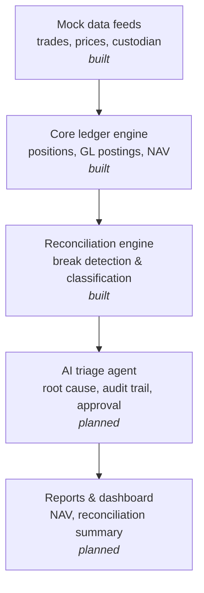
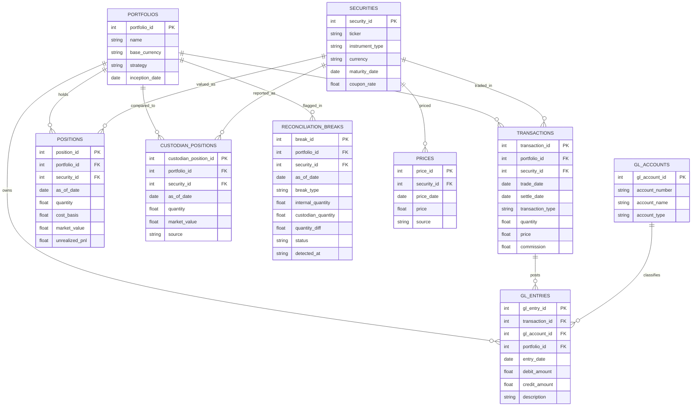

# Ledger Engine

A simplified portfolio accounting engine that mirrors the IBOR → ABOR pattern used by institutional platforms like SS&C Geneva and BlackRock Aladdin: transactions are the source of truth, positions are a derived snapshot rebuilt from transaction history rather than mutated in place, and every transaction generates a balanced pair of general ledger postings.

## Why this exists

This project demonstrates the data architecture and systems-integration thinking behind institutional portfolio accounting platforms, the same logic that sits underneath implementation work on systems like Geneva and Aladdin, built from scratch to show the mechanics rather than just describe them.

## Architecture



## Schema



## Design decisions

Positions are never updated in place. Every row in `positions` is rebuilt from scratch by summing the full transaction history up to a given date, so every position is traceable back to the exact transactions that produced it. This mirrors how a real investment book of record (IBOR) behaves.

Every transaction generates two GL entries, never one, because double-entry accounting requires it. A buy debits the security account and credits cash; a sell does the reverse.

The reconciliation engine compares internal positions against a mock custodian feed and classifies what it finds into three break types, rather than just flagging a generic mismatch: `quantity_break` when both sides report the position but the quantities disagree, `missing_custodian` when the internal book holds a position the custodian doesn't show, and `missing_internal` when the custodian reports a position that never made it onto the internal book. Every break is logged with a timestamp and an open status, so nothing gets silently dropped.

## Getting started

Requires Python 3 only — no external dependencies.

```bash
git clone <your-repo-url>
cd ledger-engine
python3 demo.py
python3 recon_demo.py
```

Expected output from `demo.py`:

```
Position as of 2024-06-01: 1000 units, cost basis $25,500.00

GL entries posted:
  DR $25,510.00  -  Buy 1000 units
  CR $25,510.00  -  Cash settlement for buy
```

Expected output from `recon_demo.py`:

```
Reconciliation run for 2024-06-01: 3 break(s) found

  [quantity_break] ACME: internal=1000.0, custodian=950.0
  [missing_custodian] TBOND: internal=500.0, custodian=None
  [missing_internal] GLOB: internal=None, custodian=200.0
```

## Project structure

```
schema.sql                # table definitions
ledger_engine.py           # core engine: transaction insertion, position recomputation, GL posting
reconciliation_engine.py    # break detection and classification against a mock custodian feed
demo.py                      # end-to-end ledger engine example
recon_demo.py                 # end-to-end reconciliation example
README.md
```

## Roadmap

- AI triage agent that proposes root causes and resolutions for flagged breaks, with a full audit trail and a human approval gate before any break is marked resolved
- Lightweight dashboard showing daily NAV, open breaks, and the audit log
