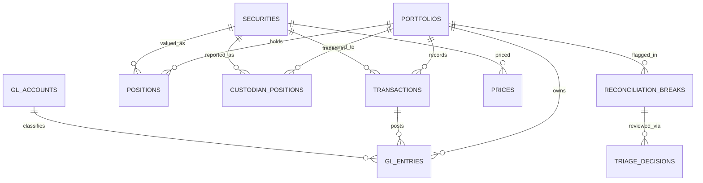

# Ledger Engine

A simplified portfolio accounting engine that mirrors the IBOR → ABOR pattern used by institutional platforms like SS&C Geneva and BlackRock Aladdin: transactions are the source of truth, positions are a derived snapshot rebuilt from transaction history rather than mutated in place, and every transaction generates a balanced pair of general ledger postings.

## Why this exists

This project demonstrates the data architecture and systems-integration thinking behind institutional portfolio accounting platforms, the same logic that sits underneath implementation work on systems like Geneva and Aladdin, built from scratch to show the mechanics rather than just describe them.

## Architecture

1. Mock data feeds (trades, prices, custodian) — *built*
2. Core ledger engine (positions, GL postings, NAV) — *built*
3. Reconciliation engine (break detection & classification) — *built*, runs off the core ledger engine
4. AI triage agent (root cause, audit trail, approval) — *built*, runs off the reconciliation engine
5. Governance & evaluation layer (accuracy, override rate, blind spots) — *built*, evaluates the triage agent
6. PnL anomaly detection (z-score vs. Isolation Forest) — *built*, runs independently off the core ledger engine, a different risk surface from reconciliation
7. Reports & dashboard (NAV, reconciliation, governance, anomalies) — *built*, combines everything above into one HTML report

## Schema



Full column-level detail for every table lives in `schema.sql` rather than duplicated here, so the diagram stays a quick-glance map of how the tables relate rather than a second copy of the schema itself.

## Design decisions

Positions are never updated in place. Every row in `positions` is rebuilt from scratch by summing the full transaction history up to a given date, so every position is traceable back to the exact transactions that produced it. This mirrors how a real investment book of record (IBOR) behaves.

Every transaction generates two GL entries, never one, because double-entry accounting requires it. A buy debits the security account and credits cash; a sell does the reverse.

The reconciliation engine compares internal positions against a mock custodian feed and classifies what it finds into three break types, rather than just flagging a generic mismatch: `quantity_break` when both sides report the position but the quantities disagree, `missing_custodian` when the internal book holds a position the custodian doesn't show, and `missing_internal` when the custodian reports a position that never made it onto the internal book. Every break is logged with a timestamp and an open status, so nothing gets silently dropped.

The triage agent proposes a root cause and suggested action for each open break, but it never resolves anything on its own. Every proposal is logged to `triage_decisions` as `pending_review`, and a break only flips to `resolved` after a human explicitly calls `approve_decision()`; calling `reject_decision()` instead leaves the break open with the rejection on record. That gate, not the proposal text, is the actual point of this layer: an audit trail where every decision is traceable to a specific human reviewer and timestamp, which is what governance actually means in a regulated ops environment. The agent runs on rule-based heuristics by default with zero external calls, and automatically switches to calling Claude for richer proposals if `ANTHROPIC_API_KEY` is set in the environment, falling back to the heuristic if that call fails for any reason.

The dashboard is a static HTML report rather than a live server: `dashboard.py` runs the full pipeline end to end and writes a single `dashboard.html` file showing NAV, positions, reconciliation breaks with their status, the complete triage audit log, and the governance report below, all openable directly in a browser with no server to start or stop.

`triage_governance.py` and `governance_demo.py` exist because a three-break demo can't tell you whether an AI triage layer is actually any good, only that it can produce an answer. The governance module runs the same heuristic proposal logic from `triage_agent.py` against a 40-scenario synthetic batch with known ground truth, then scores it: overall accuracy, accuracy broken out by break type, the override rate a human reviewer would actually see, and a simulated time cost for confirming a correct call versus catching a wrong one. The scenarios are seeded for reproducibility and explicitly synthetic, not measured production data; the point is to demonstrate the evaluation methodology rather than report a real number. The result on this batch is a specific, defensible finding rather than a flattering one: the heuristic is fully reliable on the two categorical break types, but drops to 75% on quantity breaks specifically because its fixed 1% threshold misreads small positions in both directions, missing some genuine errors and over-escalating some benign rounding. That's the kind of failure mode a human-in-the-loop gate exists to catch, and the kind of finding that should drive the next iteration of the model rather than removing the gate.

`pnl_anomaly_model.py` and `anomaly_demo.py` cover a different risk surface entirely: a PnL print that doesn't look like the rest of the series, independent of whether any position quantity ever disagreed with a custodian. This is the one module in the portfolio that uses numpy, pandas, and scikit-learn rather than being dependency-free, deliberately: the other engines are deterministic financial math that never needed a library, while anomaly detection is genuinely a statistical modeling problem, and hand-rolling an Isolation Forest from scratch wouldn't be representative of how this actually gets built. Two detectors are evaluated side by side against the same synthetic 250-day series with known ground truth, a simple rolling robust z-score and an Isolation Forest trained on rolling features, rather than presenting either one as the obvious right answer. Both catch the same share of genuine data-entry errors here, but the Isolation Forest has worse precision, flagging a run of ordinary days that happened to sit inside an elevated-volatility stretch because its second feature is the recent rolling volatility itself, not just that day's PnL. That's a real, specific cost of the more sophisticated model, not a reason to throw it out, and exactly why neither detector resolves anything on its own.

## Product framing

Treating this less like a feature and more like a product, here's how the pieces map: the user is a portfolio operations analyst working a daily reconciliation break queue, not a model researcher, so the interface that matters is "here's a proposal and here's why," not raw output. The success metric isn't "did the agent respond," it's the override rate and where it concentrates, since a high override rate on a specific break type points at exactly where the model needs work, while a low rate elsewhere says that category is safe to lean on more. The guardrail is structural, not a setting someone can turn off: nothing in `triage_decisions` can flip a break to `resolved` without a human explicitly calling `approve_decision()`, and every decision carries a reviewer and a timestamp, so the audit trail exists by construction rather than by policy. The escalation path is the override itself, every rejected or overridden proposal is exactly the training signal you'd want to route back into improving the heuristic, here that means scaling the 1% threshold to position size instead of using one fixed cutoff across every position, regardless of how small.

The same framing applies to the anomaly detector, just with a different user and a different metric. The user here is more likely a PnL controller or risk analyst reviewing the day's marks, and the metric that matters in production wouldn't be accuracy in the abstract, it'd be the false positive rate, since that's what determines whether the tool actually gets used or gets muted within a week for crying wolf. Choosing the simpler, more interpretable z-score over the Isolation Forest as the primary flag, with the ML model running alongside as a second opinion rather than the other way around, is itself a product decision: a controller who can't explain why a model flagged something won't act on it with confidence, no matter how good its theoretical recall is.

## Getting started

Requires Python 3 only — no external dependencies, even for the AI layer (it calls the Claude API directly over HTTPS rather than requiring the `anthropic` package) and the dashboard (plain HTML/CSS, no Flask or Streamlit). The one exception is `pnl_anomaly_model.py` and `anomaly_demo.py`, which use numpy, pandas, and scikit-learn since that module is genuinely a statistical modeling problem rather than deterministic financial math:

```bash
pip install numpy pandas scikit-learn
```

```bash
git clone <your-repo-url>
cd ledger-engine
python3 demo.py
python3 recon_demo.py
python3 triage_demo.py
python3 governance_demo.py
python3 anomaly_demo.py
python3 dashboard.py
```

`triage_demo.py` is interactive: it'll ask you to approve or reject each proposed resolution. `governance_demo.py`, `anomaly_demo.py`, and `dashboard.py` all run non-interactively; the dashboard auto-approves each break so the report shows a complete pipeline, while the two evaluation scripts print their full accuracy/precision/recall reports straight to the console. Open the resulting `dashboard.html` file in any browser to view the dashboard version.

To use Claude instead of the built-in heuristics for triage proposals, set your API key first:

```bash
export ANTHROPIC_API_KEY=your_key_here
python3 triage_demo.py
```

Expected output from `demo.py`:

```
Position as of 2024-06-01: 1000 units, cost basis $25,500.00

GL entries posted:
  DR $25,510.00  -  Buy 1000 units
  CR $25,510.00  -  Cash settlement for buy
```

Expected output from `recon_demo.py`:

```
Reconciliation run for 2024-06-01: 3 break(s) found

  [quantity_break] ACME: internal=1000.0, custodian=950.0
  [missing_custodian] TBOND: internal=500.0, custodian=None
  [missing_internal] GLOB: internal=None, custodian=200.0
```

Expected output from `governance_demo.py`:

```
Scenarios evaluated: 40
Agent proposal matched ground truth (approved as-is): 34
Agent proposal overridden by human reviewer:          6
Overall accuracy:     85.0%
Override rate:        15.0%

Accuracy by break type:
  missing_custodian    100.0%
  missing_internal     100.0%
  quantity_break       75.0%
```

Expected output from `anomaly_demo.py`:

```
Evaluable days: 230
True anomalies (data entry errors): 4
Legitimate high-volatility days (not anomalies): 5

Rolling robust z-score (interpretable baseline):
  Precision: 42.9%   Recall: 75.0%   F1: 0.55

Isolation Forest (unsupervised ML):
  Precision: 33.3%   Recall: 75.0%   F1: 0.46
```

## Project structure

```
schema.sql                # table definitions
ledger_engine.py           # core engine: transaction insertion, position recomputation, GL posting
reconciliation_engine.py    # break detection and classification against a mock custodian feed
triage_agent.py              # root cause proposals, audit logging, and the human approval gate
triage_governance.py          # evaluation harness: synthetic ground truth, accuracy, override rate
pnl_anomaly_model.py            # PnL anomaly detection: z-score vs. Isolation Forest, evaluated side by side
dashboard.py                     # generates a static HTML report from a full pipeline run
demo.py                            # end-to-end ledger engine example
recon_demo.py                       # end-to-end reconciliation example
triage_demo.py                        # end-to-end triage example with interactive approval
governance_demo.py                     # runs the 40-scenario evaluation and prints the report
anomaly_demo.py                          # runs the PnL anomaly detector comparison and prints the report
README.md
```

## Status

All six phases of the original architecture are now built: data feeds, ledger engine, reconciliation engine, triage agent, governance and evaluation layer, and PnL anomaly detection, on top of the original reports and dashboard. Possible next steps from here would be swapping the mock data feeds for real file formats (FIX-style trade messages, actual custodian statement layouts), persisting state across runs instead of resetting on each script invocation, feeding the triage governance layer's findings back into the heuristic itself, or giving the Isolation Forest better features so it stops picking up ordinary volatility clusters as anomalies.
