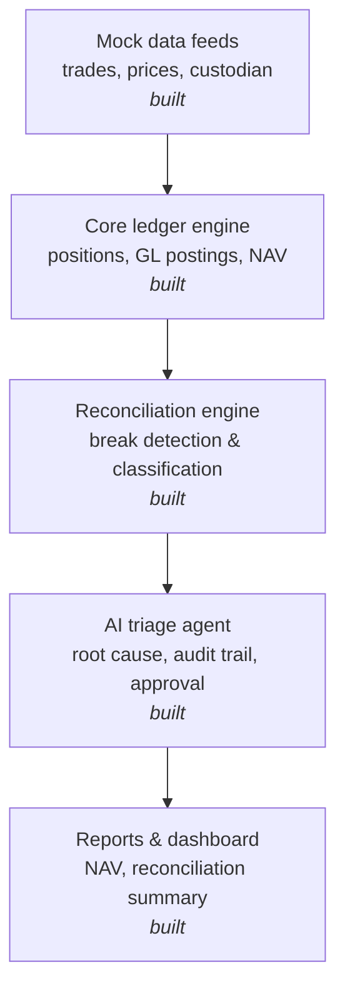
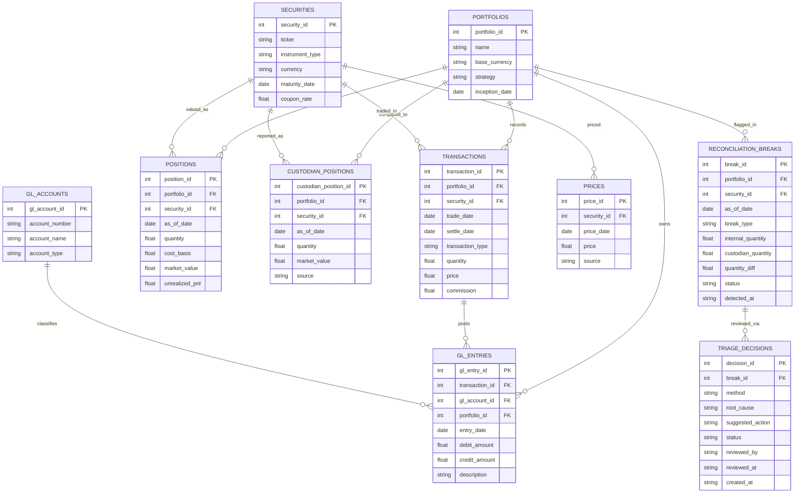

# Ledger Engine

A simplified portfolio accounting engine that mirrors the IBOR → ABOR pattern used by institutional platforms like SS&C Geneva and BlackRock Aladdin: transactions are the source of truth, positions are a derived snapshot rebuilt from transaction history rather than mutated in place, and every transaction generates a balanced pair of general ledger postings.

## Why this exists

This project demonstrates the data architecture and systems-integration thinking behind institutional portfolio accounting platforms, the same logic that sits underneath implementation work on systems like Geneva and Aladdin, built from scratch to show the mechanics rather than just describe them.

## Architecture



## Schema



## Design decisions

Positions are never updated in place. Every row in `positions` is rebuilt from scratch by summing the full transaction history up to a given date, so every position is traceable back to the exact transactions that produced it. This mirrors how a real investment book of record (IBOR) behaves.

Every transaction generates two GL entries, never one, because double-entry accounting requires it. A buy debits the security account and credits cash; a sell does the reverse.

The reconciliation engine compares internal positions against a mock custodian feed and classifies what it finds into three break types, rather than just flagging a generic mismatch: `quantity_break` when both sides report the position but the quantities disagree, `missing_custodian` when the internal book holds a position the custodian doesn't show, and `missing_internal` when the custodian reports a position that never made it onto the internal book. Every break is logged with a timestamp and an open status, so nothing gets silently dropped.

The triage agent proposes a root cause and suggested action for each open break, but it never resolves anything on its own. Every proposal is logged to `triage_decisions` as `pending_review`, and a break only flips to `resolved` after a human explicitly calls `approve_decision()`; calling `reject_decision()` instead leaves the break open with the rejection on record. That gate, not the proposal text, is the actual point of this layer: an audit trail where every decision is traceable to a specific human reviewer and timestamp, which is what governance actually means in a regulated ops environment. The agent runs on rule-based heuristics by default with zero external calls, and automatically switches to calling Claude for richer proposals if `ANTHROPIC_API_KEY` is set in the environment, falling back to the heuristic if that call fails for any reason.

The dashboard is a static HTML report rather than a live server: `dashboard.py` runs the full pipeline end to end and writes a single `dashboard.html` file showing NAV, positions, reconciliation breaks with their status, and the complete triage audit log, all openable directly in a browser with no server to start or stop.

## Getting started

Requires Python 3 only — no external dependencies, even for the AI layer (it calls the Claude API directly over HTTPS rather than requiring the `anthropic` package) and the dashboard (plain HTML/CSS, no Flask or Streamlit).

```bash
git clone <your-repo-url>
cd ledger-engine
python3 demo.py
python3 recon_demo.py
python3 triage_demo.py
python3 dashboard.py
```

`triage_demo.py` is interactive: it'll ask you to approve or reject each proposed resolution. `dashboard.py` runs non-interactively and auto-approves each break so the report shows a complete pipeline; open the resulting `dashboard.html` file in any browser to view it.

To use Claude instead of the built-in heuristics for triage proposals, set your API key first:

```bash
export ANTHROPIC_API_KEY=your_key_here
python3 triage_demo.py
```

Expected output from `demo.py`:

```
Position as of 2024-06-01: 1000 units, cost basis $25,500.00

GL entries posted:
  DR $25,510.00  -  Buy 1000 units
  CR $25,510.00  -  Cash settlement for buy
```

Expected output from `recon_demo.py`:

```
Reconciliation run for 2024-06-01: 3 break(s) found

  [quantity_break] ACME: internal=1000.0, custodian=950.0
  [missing_custodian] TBOND: internal=500.0, custodian=None
  [missing_internal] GLOB: internal=None, custodian=200.0
```

## Project structure

```
schema.sql                # table definitions
ledger_engine.py           # core engine: transaction insertion, position recomputation, GL posting
reconciliation_engine.py    # break detection and classification against a mock custodian feed
triage_agent.py              # root cause proposals, audit logging, and the human approval gate
dashboard.py                  # generates a static HTML report from a full pipeline run
demo.py                         # end-to-end ledger engine example
recon_demo.py                    # end-to-end reconciliation example
triage_demo.py                     # end-to-end triage example with interactive approval
README.md
```

## Status

All four phases of the original architecture are now built: data feeds, ledger engine, reconciliation engine, triage agent, and dashboard. Possible next steps from here would be swapping the mock data feeds for real file formats (FIX-style trade messages, actual custodian statement layouts) or persisting state across runs instead of resetting on each script invocation.
